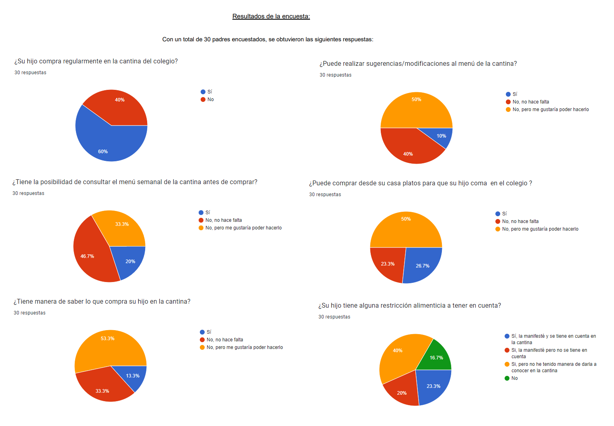
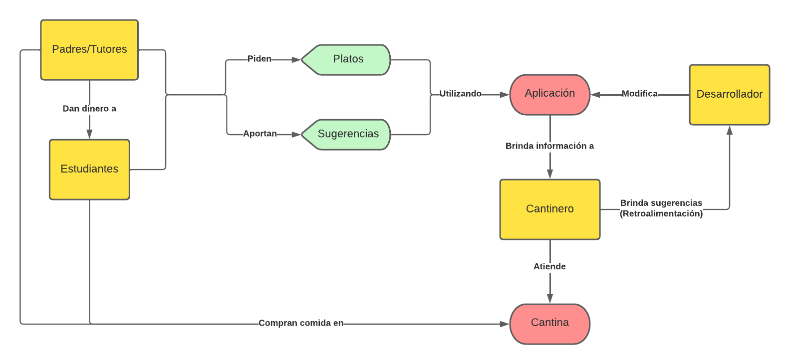
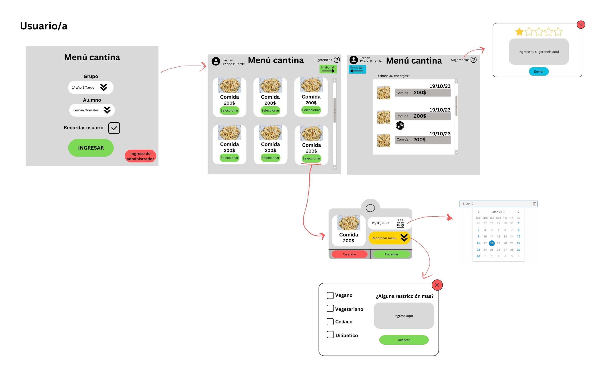
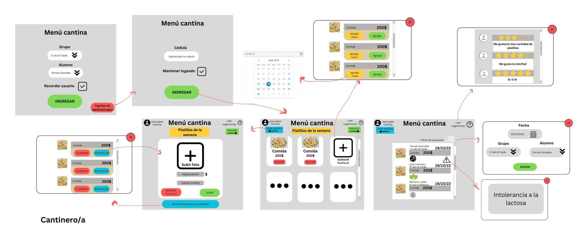

# Informe entrega 1
## Repositorio Git
Para la realización del proyecto, el grupo comenzó creando un repositorio en github. Cada uno de los integrantes clonó dicho repositorio a su computadora personal, y se comenzó a trabajar en la realización de los primeros documentos. El equipo se contactó por medio de la aplicación Discord, y se utilizó Visual Code y su terminal integrada para realizar el trabajo. En dicha terminal, se utilizaron principalmente los siguientes comandos:

*)git status, para ver en que estado se encuentra la documentación
*)git add, para añadir un archivo modificado al stage
*)git clone, para clonar un repositorio remoto al local
*)git branch, para crear una rama
*)git checkout, para movernos entre ramas
*)git commit, para establecer los cambios realizados en el repositorio remoto
*)git merge, para combinar 2 ramas distintas
*)git push, para llevar los cambios del repositorio local al remoto
*)code (nombreDelArchivo), para abrir un archivo y modificarlo en el IDE
*)cd (nombreDeCarpeta), para desplazarnos entre carpetas

Se utilizaron los repositorios locales para realizar modificaciones al proyecto, y el repositorio remoto para compartir dichas modificaciones y mantenernos al día con las actualizaciones efectuadas. A la hora de trabajar en grandes partes del proyecto, que requerían un intercambio grupal constante, un integrante del equipo compartía su pantalla en Discord mientras escribía en Visual Code, para que todos los integrantes fuesen partícipes de la modificación que se estaba realizando en el momento.

##  Versionado
Para conservar un orden, se establecieron ciertas pautas que el grupo acordó seguir durante la realización del proyecto:
1) Se deberá realizar mínimo una llamada por Discord cada dos días para discutir el estado del proyecto y/o agregar contenido al mismo.
2) Los commits siempre comenzarán con un verbo, se dirá que se hace y a qué archivo de forma clara y concisa.
3) Utilizaremos dos ramas: main y develop. Los cambios se realizarán en la rama develop. Dichos cambios se discutirán en las reuniones grupales y se decidirá si hacer un merge con la rama main.
4) Se registrará la fecha de cada merge, y se llevará un seguimiento del avance en el proyecto para manejar mejor el tiempo disponible.
5) Los commits se realizarán cada vez que agregue un cambio significativo al proyecto, pudiendo realizarse más de uno al día.

Resumen de commits y evolución del proyecto:
Fecha: Lun May 8 13:23:42 2023 -0300 | Autor: Fernan Gonzalez fernangonzalezp1@gmail.com | Nombre: Agrega reflexion grupal y detalles de trabajo individual
Fecha: Lun May 8 14:00:01 2023 -0300 | Autor: Fernan Gonzalez fernangonzalezp1@gmail.com | Nombre: Agrega PRE y POS condiciones restantes
Fecha: Lun May 8 13:41:00 2023 -0300 | Autor: Fernan Gonzalez fernangonzalezp1@gmail.com | Nombre: Agrega PRE y POS condiciones
Fecha: Lun May 8 13:06:33 2023 -0300 | Autor: Fernan Gonzalez fernangonzalezp1@gmail.com | Nombre: Agrega reflexion grupal
Fecha: Lun May 8 12:48:28 2023 -0300 | Autor: Fernan Gonzalez fernangonzalezp1@gmail.com | Nombre: Agrega validacion
Fecha: Lun May 8 12:27:26 2023 -0300 | Autor: Fernan Gonzalez fernangonzalezp1@gmail.com | Nombre: Agrega verificacion
Fecha: Lun May 8 11:21:30 2023 -0300 | Autor: Fernan Gonzalez fernangonzalezp1@gmail.com | Nombre: Correccion de links
Fecha: Lun May 8 11:19:55 2023 -0300 | Autor: Fernan Gonzalez fernangonzalezp1@gmail.com | Nombre: Correccion de links y de redaccion
Fecha: Lun May 8 11:14:27 2023 -0300 | Autor: Fernan Gonzalez fernangonzalezp1@gmail.com | Nombre: Resolucion de conflictos
Fecha: Lun May 8 11:12:26 2023 -0300 | Autor: Fernan Gonzalez fernangonzalezp1@gmail.com | Nombre: Correccion de links
Fecha: Lun May 8 11:09:32 2023 -0300 | Autor: Fernan Gonzalez fernangonzalezp1@gmail.com | Nombre: Resolucion de conflictos
Fecha: Lun May 8 11:00:49 2023 -0300 | Autor: Fernan Gonzalez fernangonzalezp1@gmail.com | Nombre: Correccion ortografica y de links
Fecha: Lun May 8 10:52:43 2023 -0300 | Autor: Fernan Gonzalez fernangonzalezp1@gmail.com | Nombre: Cambio de lugar de archivos y correccion ortografica
Fecha: Lun May 8 10:42:32 2023 -0300 | Autor: Nicolas Toscano toscanico3@gmail.com | Nombre: Corrige links imagenes
Fecha: Lun May 8 10:39:36 2023 -0300 | Autor: Nicolas Toscano toscanico3@gmail.com | Nombre: Agrega links imagenes
Fecha: Lun May 8 10:26:44 2023 -0300 | Autor: Nicolas Toscano toscanico3@gmail.com | Nombre: Agrega links imagenes
Fecha: Sun May 7 23:43:58 2023 -0300 | Autor: Nicolas Toscano toscanico3@gmail.com | Nombre: Agrega Bloque elicitacion y especificacion
Fecha: Mar May 2 21:19:29 2023 -0300 | Autor: Fernan Gonzalez fernangonzalezp1@gmail.com | Nombre: Merge con de Main con Develop
Fecha: Jue Apr 27 16:40:50 2023 -0300 | Autor: Fernan Gonzalez fernangonzalezp1@gmail.com | Nombre:Agrega apartado versionado a informe
Fecha: Jue Apr 27 15:50:23 2023 -0300 | Autor: Fernan Gonzalez fernangonzalezp1@gmail.com | Nombre:Agrega apartado repositorio git a informe
Fecha: Dom Apr 23 18:42:19 2023 -0300 | Autor: Fernan Gonzalez fernangonzalezp1@gmail.com | Nombre:Agrega preguntas para entrevistas
Fecha: Lun Mar 27 14:51:33 2023 +0000 | Autor: Fernan Gonzalez fernangonzalezp1@gmail.com | Nombre:Initial commit

## Elicitación

La elicitación de requerimientos trata de un proceso de identificación de necesidades y restricciones de distintos agentes para un determinado software.
Se utiliza usualmente para descubrir todo tipo de requerimiento y otro tipo de información acerca del software. 
Las técnicas de elicitación a desarrollar serán: 
- user personas
- entrevistas
- focus group 
- cuestionarios

User persona: Trata de un personaje semi ficticio el cual se crea basándose en un cliente actual. Estos se crean para mejorar el marketing del producto teniendo una comunicación con los usuarios del mismo. 

Nombre: Natalia Canabarro
Edad:42
Ocupación: Docente
Localidad: Montevideo
Estado civil: Soltera
Objetivos: Que mi hija incorpore buenos hábitos alimenticios
Motivaciones: El compartir con los amigos
Desafíos: Incorporar nuevos alimentos y aprender a manejarse con el dinero

Entrevistas: Las entrevistas se realizarán a usuarios del producto. Las preguntas de la misma pueden ser tanto libres de contexto referenciando un problema del usuario, o con un contexto en el cuál se brinden soluciones a dicho problema.
Las entrevistas se pueden encontrar en la carpeta del proyecto: [entrevistas](entrevistas.md)

Focus group: Los focus group son un grupo representativo de usuarios que se eligen para dar ideas acerca de los requerimientos del producto. Estos incluyen reuniones interactivas donde todos pueden participar y dar su opinión acerca de cómo mejorarlo, sus preferencias, necesidades, etc. 
Para el caso de este proyecto se realizó una reunión con un cliente introduciendo ideas acerca de cómo podría ser el resultado final. Este fue capaz de analizarlo y brindar numerosas ideas para poder mejorar tanto la calidad como la cantidad de servicios que este producto le pueda brindar.
Específicamente las ideas que brindo fueron:
- Poder modificar el menú diario, tener la opción de pedir algo especifico que este por fuera del menú o que se sirva en otro día.
- Poder tener un espacio dedicado a las sugerencias
- Que sea visible la disponibilidad del menú, ver que días está disponible cada plato de comida. 

Cuestionarios: Son un conjunto de preguntas cerradas las cuales tienen 2 o mas opciones de respuesta. Las preguntas no deben ser ambiguas ni tampoco tienen que ser muchas ya que sino los usuarios no querrán responderlas. 
Los resultados de los cuestionarios se pueden encontrar en la carpeta de archivos del proyecto 

Mapa conceptual: Un mapa conceptual es un cuadro gráfico que representa de forma visual como los conceptos dentro de un tema específico se relacionan e interactúan entre sí.
Se puede encontrar en la carpeta de archivos del proyecto 

## Especificación

Requerimientos funcionales y no funcionales
La ingeniería de requerimientos es utilizada para poder entender las necesidades que tienen los clientes y los usuarios a la hora de utilizar un sistema y poder transformarlas en requerimientos técnicos a implementar en el mismo.
En primer lugar, se debe comprender y enunciar el problema para luego poder dar una solución al mismo y por último poder validarla. 
Los requerimientos son una descripción de cómo se debe comportar el sistema, sus propiedades o atributos. También pueden ser restricciones, como también condiciones requeridas por el usuario para resolver problemas o alcanzar un objetivo.

Los requerimientos funcionales son servicios y funciones específicas del sistema: como se procesa la información brindada y recibida por el mismo. 
En este proyecto algunos ejemplos de requerimientos funcionales pueden ser:

-La elección del plato del menú a consumir. 
Consiste en que los responsables del niño puedan, de manera sencilla, elegir que plato de comida va a comer y en que día.
Prioridad: alta.

PRE: Que existan platos de comida registrados
POS: Que el plato quede corretamente encargado
User Case:
Título: Pedir plato        Actor: Responsables del niño
Curso normal:
Acción                     Respuesta
Elección del plato         Registro del plato en el sistema
Curso alternativo:
Si el plato no está disponible ese día: se emite mensaje: "Este plato no está disponible para este día".

-La existencia de un registro de los platos de comida.
Poder guardar en un registro los platos que el niño consumió, para luego poder consultarlo y tener una constancia del mismo.
Prioridad: alta. 

PRE: Que el niño esté ingresado en el sistema.
POS: Que la comida quede guardada en el registro del niño seleccionado.
User Case:
Título: Guardar registro      Actor: Sistema
Curso normal:
Acción                                              Respuesta
Registrar los platos consumidos por cada niño       Mostrar en una tabla el registro de cada niño
Curso alternativo:
Si el niño no tiene ningún plato ordenado, se emite mensaje: "No hay registro de platos ordenados".

-Modificaciones a plato seleccionado del menú.
Poder modificar el plato a gusto del consumidor a través de la aplicación.
Prioridad: alta.

PRE: Tener seleccionado un plato.
POS: Guardar las modificaciones realizadas al mismo.
User case:
Título: Modificar menú      Actor: Responsables del hijo
Curso normal:
Acción                                                Respuesta
Modificar el plato del menú a gusto y conveniencia    Quede registrado el pedido con sus modificaciones

-Disponibilidad del menú.
Tener la posibilidad de ver que días van a estar determinados platos disponibles en el menú.
Prioridad: baja.
-Sección de sugerencias.
Que exista una sección en la aplicación para poder dejar sugerencias a la cantina.
Prioridad: media.

Los requerimientos no funcionales son servicios previstos por el sistema, enfocados al aspecto técnico. Pueden estar vinculados a un requerimiento funcional, pero generalmente son aplicables a todo el sistema. 
Algunos ejemplos de estos en este proyecto pueden ser:

-Registro ilimitado de comidas.
Poder registrar una cantidad ilimitada de comidas para un mismo usuario.
Prioridad: alta.

PRE: Que sea un plato de comida no registrado en el sistema
POS: Se registra el plato de comida y se muestra en el menú
User case:
Título: Registro comidas           Actor: Responsable de la cantina. 
Curso normal:
Acción                             Respuesta
Registrar comidas en el sistema.    Sean visibles para el usuario de la página, aplicación.

-Registro ilimitado de usuarios.
Poder registrar una cantidad ilimitada de usuarios.
Prioridad: alta.

PRE: Que el alumno a registrar esté inscripto en el colegio
POS:  El alumno se registra y se muestra en menú despleglable como opción a seleccionar.
User case:
Título: Registro de usuarios.       Actor: Cantinero.
Curso normal:
Acción                                          Respuesta 
Registrar en la página a todos los alumnos      Generación de un registro para cada uno

-Filtrado de alumnos en el registro.
Que funcione correctamente el filtrado de la tabla de registros a la hora de consultar la información de cada uno.
Prioridad: alta.

PRE: Que existan alumnos registrados
POS: Que se muestre sólo el registro del alumno seleccionado
User case:
Título: Filtrado registro           Actor: Sistema
Curso normal:
Acción                                             Respuesta
Elegir un alumno para poder ver su registro        Se muestra únicamente el registro de este alumno.
Curso alternativo:
Si el alumno no tiene nada en el registro, no se muestra nada en el mismo. 

-Utilización de HTML5 y JavaScript.
Que la página, aplicación, sea realizada tanto con HTML5 como con JavaScript. 
Prioridad: media.

-Utilizable en todo tipo de dispositivos.
Se tiene que poder usar tanto en dispositivos Android como iOS.
Prioridad: alta.

PRE: -
POS: Todas las funcionalidades de la aplicación se ejecutan correctamente
User case:
Título: Usabilidad.      Actor: Sistema.
Curso normal: 
Acción                                            Respuesta
Utilizar el sistema en cualquier dispositivo      Que funcione correctamente en todos ellos

-Adaptable a cualquier tamaño de pantalla.
La página, aplicación se adapte a diversas dimensiones de pantalla. 
Prioridad: alta.

PRE: -
POS: Que la aplicación se adapte a distintas dimensiones de pantalla.
User case:
Título: Adaptabilidad.       Actor: Sistema.
Curso normal:
Acción                                                         Respuesta
Utilizar el sistema en dispositivos de diferentes tamaños      Que se adapte a la pantalla de cada uno

User stories: 

Título: Menú escolar.
Como(rol): madre
Quiero: Lista de los menús que hay día a día.
Para: que mi hijo pueda elegir y a su vez yo saber lo que come.
Criterios de aceptación: Ese menú tiene que tener opción a posibles casos de niños diabéticos y/o celíacos. Todo detallado y que le llegue a cada responsable del niño a través de la aplicación del colegio o de un WhatsApp.

Título: Registro en la cantina.
Como: Madre.
Quiero: Llevar un registro más real de lo que consume mi hija en la cantina.
Para: Estar en conocimiento de lo que pide y cuáles son sus gastos.
Criterios de aceptación: 
-Tienen que estar los precios de lo que pide y cuáles son sus gastos en la página.
-Tener una actualización semanal o diaria en lo posible de éste. 

Bocetos:
Se realizaron bocetos de baja fidelidad utilizando la herramienta Canva, uno para el cantinero y otro para el usuario:  

## Validación y verificación

Checklist requerimientos:

Completitud

¿Se encuentran todos los requerimientos correctamente priorizados? - Sí.
¿Son todas las clases de usuarios identificados y sus características descriptas? - Sí.
¿Respeta la especificación a estructura y apartados del estándar? - Sí.
¿Se identifican y describen las dependencias con otros sistemas? - Sí.
¿Están todas las características de calidad tenidas en cuenta en la especificación? - Sí.

Verificabilidad y no ambiguedad

¿Tiene cada requerimiento una única interpretación? - Sí.
¿Puede ser cada requerimiento verificado por alguna prueba, demonstración,
revisión o análisis? - Sí.

Correctitud y consistencia

¿Están los requerimientos esritos en forma consistente y a un nivel de detalle
adecuado? - Sí.
¿Existe duplicación de requerimientos o conflicto entre requerimientos? - No.
¿Está cada requerimiento dentro del alcance del problema a resolver? - Sí.
¿Evitan los requerimientos incluir aspectos de diseño o implementación de la
solución? - Sí.

Trazabilidad

¿Puede cada requerimiento ser identificado correctamente y en forma única? - Sí.
¿Se referencian correctamente los requerimientos entre si? - Sí.
¿Puede cada requerimiento ser referenciado hasta su origen (alguna necesidad de los stakeholders)? -Sí.

Checklist casos de uso

¿Cumple el caso de uso un único objetivo o tarea? - Sí, en su mayoría.
¿Es su objetivo un resultado medible para el usuario? - Sí.
¿Queda claro que actor(es) participan y benefician del caso de uso? - Sí.
¿Existe una secuencia lógica en los pasos que permita entender la transacción entre actor y sistema? - Sí.
¿Es el nivel de abstracción de las transacciones adecuado para el caso de uso? - Sí.
¿Está el caso de uso libre de detalles de diseño e implementación de posibles soluciones? - Sí.
¿Se documentan todos los posibles cursos alternativos y excepcionales? - Sí.
¿Existen pre y pos condiciones que contextualicen correctamente el caso de uso? - Sí.

Revisión de pares:

Se consultó a personas en la calle su opinión del boceto de la aplicación. En general las personas opinaros que les parecía correcta, tanto en el diseño como en su potencial utilidad. Finalmente, solicitamos, que nos dieran sus sugerencias para poder mejorarla. A continuación, las sugerencias que recaudamos:
-Agregar opción para elegir bebidas junto con el menú.
-Agregar opción hipertenso en restricciones alimenticias.
-Agregar la posibilidad de comprar comestibles que no sean platos de comida (galletitas, alfajores, entre otros).

## Reflexión

Reflexión grupal:

Como grupo, consideramos que el trabajo en el proyecto fue muy beneficioso para nuestro aprendizaje, ya que utilizamos diversas herramientas nuevas, tanto de versionado como de diseño, que serán muy utiles para nuestro futuro desempeño profesional. Por otra parte, supimos sobrellevar las dificultades que se nos presentaron al manipular estas herramientas, y logramos construir un ambiente de trabajo ameno. A modo de autocrítica, no nos fue posible llevar a cabo el cronograma de trabajo que nos planteamos al comienzo de la elaboración del proyecto, aunque hayamos logrado desarrollar todo lo que nos propusimos en los tiempos establecidos. Consideramos que podríamos haber sido más constantes en nuestra dinámica de trabajo, aspecto que apuntos a mejorar en la segunda entrega.

Detalle de trabajo individual:

Fernán González:
-Mapa conceptual
-Encuestas
-Validación de pares
-Revisión y corrección ortográfica

Nicolás Toscano:
-Entrevista
-User personas
-Focus group
-User stories

Marcelo Larrarte:
-Boceto de la aplicación

De forma grupal:
-Repositorio git y versionado
-Validación y verificación
-Reflexión
-User case
-Requerimientos funcionales y no funcionales
